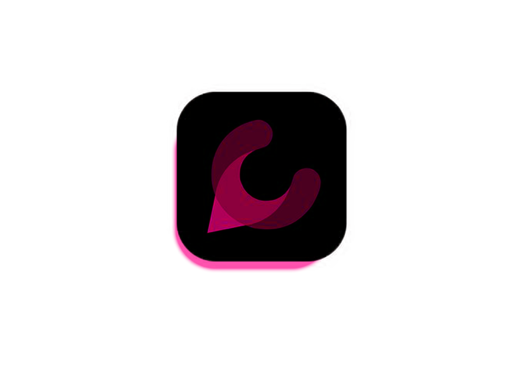

 

step 1:- JUST CLONE THIS REPOSITORY AND TRY TO DOWNLOAD ALL THE MODULES 
step 2:- NOW TO START GO THE FRONTEND DIRECTORY ... OPEN YOUR TERMINAL AND RUN:- npm run dev
step 3:- THEN OPEN THE NEW TERMINAL PAGE AND IN THAT YOU NEED TO IN THE BACKEND DIRECTORY AND RUN :- nodemon

step 4:- NOW GO INTO YOUR BROWSER AND SEARCH:- localhost:5173
step 5:- YOUR CHAT WEBSITE IS READY 🫡

NOTE:- BEFORE FOLLOWING THE ABOVE STEPS YOU NEED TO INSTALL ALL THE PACKAGES AND CHANGE THE MONGODB LINK BECAUSE I AM NOT USING MONGODB ATLAS OR ANY OTHER ONLINE DATABASE TO STORE THE USER INFORMATION💡........

                     TILL THEN I'LL SE YOU IN THE NEXT ONE (●'◡'●)
